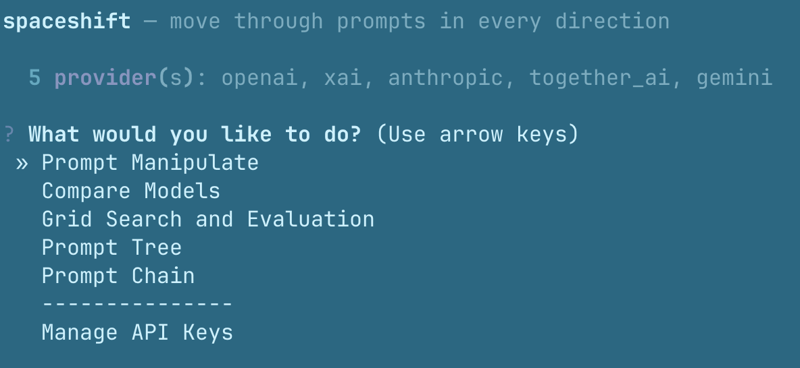
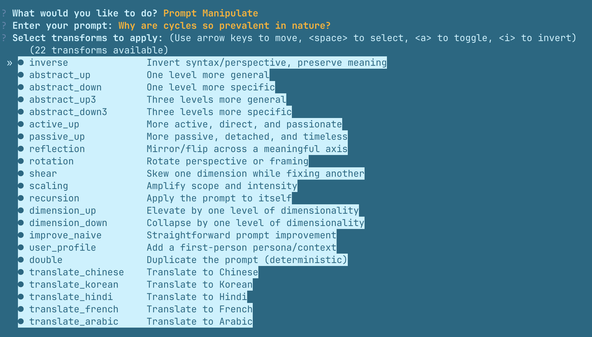
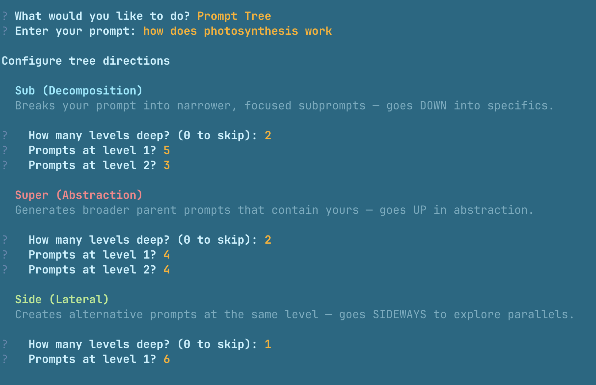
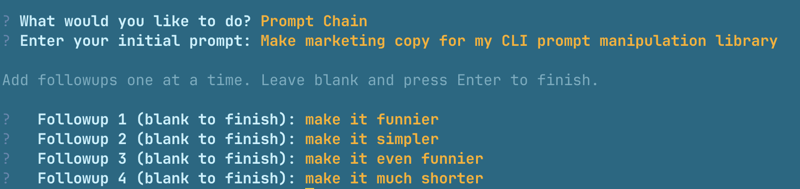
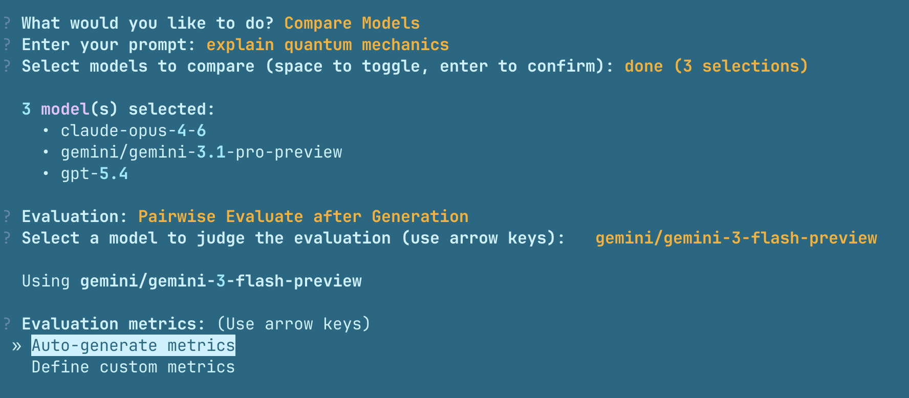

# spaceshift

An interactive CLI prompt exploration toolkit powered by LLMs. Manipulate prompts through transforms, navigate the full space of perspectives, and evaluate across prompts and models to find what works best.

**[Full documentation at spcshft.com](https://spcshft.com)**



```bash
pip install spaceshift
spaceshift
```

Pick a mode, pick a model from categorized rankings, enter your prompt. Results save as structured markdown with YAML frontmatter, and the built-in viewer opens automatically.

---

### Install

```bash
pip install spaceshift
```

On first run, spaceshift guides you through setting up API keys:

```bash
$ spaceshift

No API keys found. Let's set up your providers.

  OpenAI (press Enter to skip): sk-proj-...
  ✓ OpenAI key saved

  Anthropic (press Enter to skip): sk-ant-...
  ✓ Anthropic key saved

  Google Gemini (press Enter to skip): [Enter]
  Together.AI (press Enter to skip): [Enter]
  xAI (press Enter to skip): [Enter]

✓ Configuration saved to ~/.spaceshift/config.json
```

Keys are stored in `~/.spaceshift/config.json` and available globally. Update them anytime via the **Manage API Keys** option in the main menu.

---

### Modes

#### Prompt Manipulate

Transform a prompt through 22 built-in operations — abstraction up/down, inversion, reflection, rotation, dimension shifts, translations, and more — then optionally generate responses for each variant.



#### Prompt Tree

Explore a prompt in three directions simultaneously: **sub** (decomposition into specifics), **super** (abstraction upward), and **side** (lateral alternatives). Configure depth per direction through a guided wizard.



#### Prompt Chain

Build a multi-turn conversation by adding followups one at a time. Each turn runs with full prior context and saves alongside the chain history.



#### Compare Models

Run the same prompt across multiple models and rank the responses. Optionally add pairwise evaluation with a judge model and auto-generated or custom metrics.



#### Grid Search and Evaluation

Sweep across models × transforms simultaneously and rank every combination to find what works best.

---

### Viewing Results

Browse any output directory in the browser with the built-in viewer:

```bash
spaceshift view output_directory
```

Two-panel layout: sidebar with smart-sorted file list, content area with rendered markdown and frontmatter metadata cards. No dependencies — runs on Python's stdlib server with client-side markdown rendering.

---

## Advanced Usage

While spaceshift is designed as a CLI tool, advanced users can import and use the underlying modules programmatically. **This is unsupported** — the CLI is the primary interface, and internal APIs may change without notice.

For those who want to explore anyway, the main modules are in `spaceshift/` including `LLM`, `prompt_tree`, `compare_models`, `grid_search`, etc. See the source code for details.
